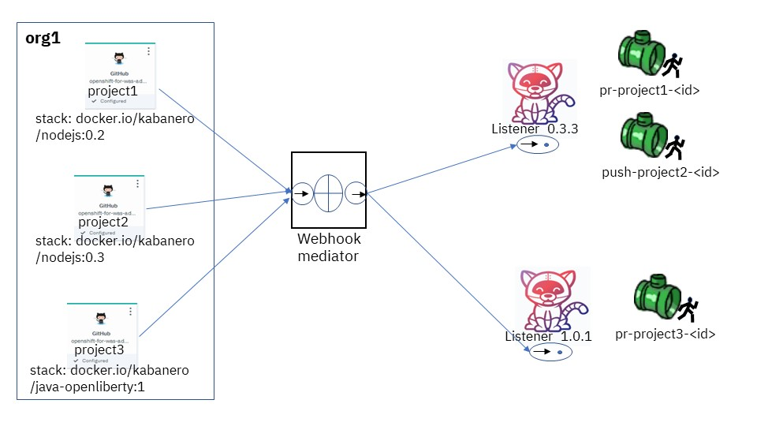

# events-operator
[](https://travis-ci.com/kabanero-io/events-operator)

## Table of Contents
- [Introduction](#introduction)
- [Functional Specification](#functional-specification)
- [Webhook Processing](#webhook-processing)
- [Kabanero Integration](#kabanero-integration)
- [Tech Preview](#tech-preview)
- [Migrating from Tekton Webhooks Extension](#migrating-from-tekton-webhooks-extension)

<a name="introduction"></a>
## Introduction

The events operator allows users to define a Kubernetes centric event mediation flow. Through custom resource
definitions, users can quickly construct mediation logic to receive, transform, and route JSON data structure. The
transformation logic is based on Common Expression Language (CEL).

The use cases for event mediator include:

- Transformation of and routing arbitrary JSON data structure.
- Webhook processing
- Integration with Kabanero, including driving Tekton pipelines.

<a name="functional-specification"></a>
## Functional Specification

The main components of events infrastructure are:

- event mediator: defines what is to be run within one container. It consists of an optional https listener, and a list
  of mediations.
- event mediation: user defined logic used to transform or route events.
- event connection: defines the connections between mediations, and between mediations and external http(s) listeners .

Like other Kubernetes resources, the event mediators, mediations, and connections may be changed dynamically.

### Event Mediators

An event mediator contains a list of mediations. As an example:

```yaml
apiVersion: events.kabanero.io/v1alpha1
kind: EventMediator
metadata:
  name: webhook
spec:
  createListener: true
  createRoute: true
  mediations:
    - mediation:
        name: webhook
        sendTo: [ "dest"  ]
        body:
          - = : 'sendEvent(dest, message)'
```

When the attribute `createListener` is `true`, a https listener is created to receive JSON data as input. 
In addition, a `Service` with the same name as the mediator's name is created so that the listener is accessible. 
An OpenShift service serving self-signed TLS certificate is automatically created to secure the communications. 
No authentication/authorization is currently implemented.

The URL to send a JSON message to the mediation within the mediator is `https://<mediatorname>/<mediation name>`.
For example: `https://webhook/webhook`. The `<mediation name>` in the URL addresses the specific mediation within the mediator.

When both attributes `createListener` and `createRoute` are set to `true`, a new `Route` with the same name as the
mediator is created to allow external access to the mediator. The external host name for the `Route` is installation
specific.
The default URL to send a message to the mediation is `https:<external name>/<mediation name>`.
For example: `https://webhook-default.apps.mycompany.com/webhook`.


### Event Mediations

Each event mediation within a mediator defines one path for message processing.
Its general form looks like :

```yaml
  mediations:
    - mediation:
        name: <mediation name>
        variables:
            - name: <variable-name-1>
              value: <variable-value-1>
            - name: <variable-name-2>
              value: <variable-value-2>
            ...
        sendTo: [ "destination 1", "destination 2", ...  ]
        body:
           <body>
```


The attributes are:

- name: the name of the mediation. Note that the URL to the mediator must include the mediation name as the component of the path.
- variables: predefined name/value pairs that may be used as predefined variables within the `body` of the mediation.
- sendTo: list of variable names that represent destinations to send output message.
- body: body that contains code based on Common Expression Language (CEL) to process the message.

Two additional implicitly pre-defined variables are also available for a mediation:

- `body`: body of the incoming message
- `header`: HTTP header of the incoming message.

The `body` of a mediation is an array of JSON objects, where each object may contain one or multiples of:

- An assignment
- An `if` statement
- A `switch` statement
- A `default` statement (if nested in a switch statement)
- A nested `body`

For examples:

```yaml
apiVersion: events.kabanero.io/v1alpha1
kind: EventMediator
metadata:
  name: example
spec:
  createListener: true
  createRoute: true
  mediations:
    - mediation:
        name: mediation1
        sendTo: [ "dest1", "dest2", "dest3"  ]
        body:
          - =: 'attrValue = "" '
          - if: "has(body.attr)"
            =: "attrValue = body.attr"
          - switch:
              - if : ' attrValue == "value1" '
                =: "sendEvent(dest1, body, header)"
              - if : 'attrValue == "value2" '
                =: "sendEvent(dest2, body, header)"
              - default:
                =: "sendEvent(dest3, body, header)"
```

More formally,

- A `body` is an array of JSON objects, where each array element that may contain the attribute names : `=`, `if`,
  `switch`, and `default`.
- The valid combinations of the attribute names in the same JSON object are:
  - `=`: an single assignment statement
  - `if` and `=` : The assignment is executed when the condition of the `if` is true
  - `if` and `body`: The body is executed when the condition of the if is true
  - `switch` and `body`: The body must be array of JSON objects, where each element of the array is either an `if`
    statement, or a `default` statement.

Below are examples of assignments. 
Note that variable name is optional.

```yaml
=: 'attrValue = 1"
=: " sendEvent(dest, body, header)
```

The first variation of an `if` statement:

```yaml
 - if : ' attrvalue == "value1" '
   =: "sendEvent(dest1, message)"
```

And second variation of an `if` statement with a `body`:

```yaml
- if : ' attrvalue == "value1" '
  body:
    - =: "attr = "value1""
    - =: "sendEvent(dest1, body, header)"
```

An example of `switch` statement:

```yaml
- switch:
  - if : ' attrvalue == "value1" '
    =: "sendEvent(dest1, body, header)"
  - if : 'attrValue == "value2" '
    =: "sendEvent(dest2, body, header)"
  - default:
    =: "sendEvent(dest3, body, header)"
```

#### Built-in functions


Additional bult-in functions are provided to falicitate event processing and routing. 
These are in addition to stanard functions in the Common Expression Language.

<!--
##### filter

The `filter` function returns a new map or array with some elements of the original map or array filtered out.

Input:
- message: a map or array data structure
- conditional: CEL expression to evaluate each element of the data structure. If it evaluates to true, the element is
  kept in the returned data structure. Otherwise, it is discarded. For a map, the variable `key` is bound to the key of
  the element being evaluated, and the `value` variable is bound to the value. For an array, only the `value` variable
  is available.

Output:
- A copy of the original data structure with some elements filtered out based on the condition.

Examples:

This example keeps only those elements of the input `header` variable that is set by github:

```yaml
 - =: 'newHeader =  filter(header, " key.startsWith(\"X-Github\") || key.startsWith(\"github\")) '
 ```


 This example keeps only those elements of an integer array whose value is less than 10:
```yaml
   - =: 'newArray=  filter(oldArray, " value < 10 " )
```

##### call

The `call` function is used to call a user defined function.

Input:

- name: name of the function
- param: parameter for the function

Output:

- return value from the function


Example:

The function `sum` implements a recursive function to calculate sum of all numbers from 1 to input:

```yaml
functions:
  - name: sum
    input: input
    output: output
    body:
      - switch:
          - if : 'input <= 0'
            =: ' output = input '
          - default:
            - =: 'output=  input + call("sum", input- 1)'
```
-->

##### sendEvent

The sendEvent function sends an event to a destination.

Input:

- destination: destination variable to send the event
- body: a JSON compatible message body of message.
- header: HTTP header for the message.


Output: empty string if OK, otherwise, error message

Example:

```yaml
  - =: 'sendEvent(tekton-listener, body, header)'
```

#### eventListenerURL("deploy-kustomize-listener")

The eventListenerURL function returns the URL for an event listener.

Input:

- listener: name of the event listener in the current namespace

Output:  the internal URL of the event listener if found. Otherwise, an error message.

Example:

```yaml
  - =: 'url = eventListenerURL("deploy-kustomize-listener")'
```

<!--
##### jobID

The `jobID` function returns a new unique string each time it is called.


##### toDomainName

The `toDomainName` function converts a string into domain name format.

Input: a string

Output: the string converted to domain name format

##### toLabel


The `toLabel` function converts a string in to Kubernetes label format.

Input: a string

Output: the string converted to label format

##### split

The `split` function splits a string into an array of strings.

Input:

- str: string to split
- separator: the separator to split on

Output: array of string containing original string separated by the separator.

Example:

```yaml
  - =: 'components = split('a/b/c', '/') '
```

After split, the variable components contains `[ "a", "b", "c" ]`.
-->

### Event Connections

Event connections map the destinations of mediations to real endpoints. Currently only https endpoints are supported.

Given the mediator with mediation named `webhook` below:

```yaml
apiVersion: events.kabanero.io/v1alpha1
kind: EventMediator
metadata:
  name: webhook
spec:
  createListener: true
  createRoute: true
  mediations:
    - mediation:
        name: webhook
        sendTo: [ "dest"  ]
        body:
          - = : 'sendEvent(dest, body, header)'
```

The connection specification may look like:

```yaml
apiVersion: events.kabanero.io/v1alpha1
kind: EventConnections
metadata:
  name: example1
spec:
  connections:
    - from:
        mediator:
            name: webhook
            mediation: webhook
            destination: dest
      to:
        - https:
            - url: https://mediator1/mediation1
              insecure: true
            - urlExpression: cel_expression
              insecure: true
```

The `from` attribute specifies:

- The name of the mediator
- The name of the mediation within the mediator
- The name of the destination for the mediation.

The `to` attribute currently only supports https endpoints. The url may be any REST endpoint. If pointing to another
mediator, the other mediator's `createListener` attribute must be set to `true`, and the URL to use is:
`https://<service-name>/<mediation name>`, where `<service-name>` is the name of the mediator.

The `urlExpression`  is used to enable dynamically generated destinations. 
It is an Common Expression Language expression evaluated within the scope of the mediation.


<a name="webhook-processing"></a>
### Webhook Processing

The mediator framework provides additional function to facilitate the processing of webhook messages.
Currently only `github` webhook messages are supported.
For example:

```yaml
apiVersion: events.kabanero.io/v1alpha1
kind: EventMediator
metadata:
  name: webhook
spec:
  createListener: true
  createRoute: true
  repositories:
    - github:
        secret: your-github-secret
        webhookSecret: my-webhook-secret
  mediations:
    - mediation:
        name: appsody
        selector:
          - urlPattern: webhook
          - repositoryType:
            file: .type1.yaml
            newVariable: message.body.webhooks-type1
        sendTo: [ "dest"  ]
        variables:
          - name: message.body.webhooks-tekton-service-account
            value: kabanero-pipeline
          body:
              - = : 'sendEvent(dest, body, header)'
    - mediation:
        name: gitops
        selector:
          - urlPattern: webhook
          - repositoryType:
            name: message.body.webhooks-type2
            file: .type2.yaml
        sendTo: [ "dest"  ]
        body:
          - = : 'sendEvent(dest, body, header)'
  ```

The `repositories` attribute defines repository related configuration. For `github` repository, 

- `secret` points to a Kubernetes `Secret`. It has the same format as the Tekton user name/password secret, where username is the user name is the user name to Github, and password is the API key to access github. 
- `webhookSecret` is used to authenticate the originator of the webhook message. It is the same secret you specified when configuring the webhook
on github.

The `selector` defines which mediation to call based on the specified criteria:

- The `urlPattern` matches the pattern to the incoming URL. Currently only exact match is supported.
- The `repositoryType` matches the type of the repository. The mediation is called only if the specified `file` exists in the repository. 
In addition, the content of the `file` is read and bound to the the variable `newVariable`.

The `varibles` section creates new variables.

In addition, the mediation automatically adds additional predefined variables to the body of the incoming message after the creation of the repository variables. 
Though these variables are meant to be used for Tekton event listeners, they
are generic enough to be used by other downstream listeners as well.

- `body.webhooks-tekton-git-server`:  The name of the incoming git server. For example, `github.com`
- `body.webhooks-tekton-git-org` : The git organization
- `body.webhooks-tekton-git-repo`: The name of the git repository.
- `body.webhooks-tekton-git-branch`: The branch in the github repository.
- `body.webhooks-tekton-event-type`: One of `pull_request`, `push`, or `tag`.
- `body.webhooks-tekton-monitor`: `true` if the monitor task should be started.
- `body.webhooks-tekton-github-secret-name`: The name of the configured github secret.
- `body.webhooks-tekton-github-secret-key-name`: The name of the key in the secret that points to the API token to access github. Currently, it is set to `password`.
- `body.webhooks-tekton-sha`: for a tag event, the SHA of the repository commit.
- `body.webhooks-tekton-tag-version`: for a tag event, the value of the tag, usually a new version number such as 0.1.0.
- `body.webhooks-kabanero-tekton-listener`: for Appsody repositories, the URL of the best match Tekton event listener configured to perform Appsody builds, or `http://UNKNOWN_KABAKERO_TEKTON_LISTENER` if not found.


When processing an incoming webhook message, the flow is as follows:

- The github secret is used to authenticate the sender.
- The variables `body` and `header` are created to store the body and header of the message.
- The selector is evaluated in turn to locate the matching mediation.
- The pre-defined variables are created.
- The `variables` section are evaluated in order.
- The mediation logic is called.


<a name="kabanero-integration"></a>
### Kabanero Integration

This section contains a tutorial on how the event mediator is integrated with Kabanero.
The integration point is to use the event mediator
as a organizational webhook to drive Tekton pipelines installed with Kabanero.

#### Basic Architecture



As shown above,  the webhook mediator may be used with a github organizational webhook. 
Once defined, all webhook events within the organization are sent to the the same webhook mediator.  
The mediator does the following for appsody projects:

1. Determine that the type of the repository is appsody.
2. Find the best matching Tekton event listener based on the semantic version of the project.
3. Generate parameters required for the Tekton listener and Tekton trigger bindings.
4. Forward the request to the listener.

For example, the steps to process the pull request for project2 involves:

1. Webhook mediator receives a pull request webhook event.
2. Webhook mediator determines the type of the repository is appsody, and the requested stack version 0.3.
3. Webhook mediator locates the Tekton event listener that best matches the stack, which is listener for stack version 0.3.3.
4. Webhook mediator add the Tekton related parameters to the message body.
5. Webhook mediator forwards the webhook message with the added parameters to the Tekton listener.

Note that for our example, there is no match for project1 , while the match for project3 is for version 1.0.2.


#### Install Kabanero

Follow the instructions here: https://kabanero.io/docs/ref/general/installation/installing-kabanero-foundation.html

#### Change to kabanero project

Change to the project where kabanero is installed. The default is `kabanero`. For example,

```
oc project kabanero
```

#### Create Kabanero CRD with events-operator enabled

Edit and apply the following yaml to use the default stacks and events based pipeline:


```yaml
apiVersion: kabanero.io/v1alpha2
kind: Kabanero
metadata:
  name: kabanero
spec:
  stacks:
    repositories:
    - name: central
      https:
        url: https://github.com/kabanero-io/kabanero-stack-hub/releases/download/0.9.0/kabanero-stack-hub-index.yaml
    pipelines:
    - id: default
      sha256: b4ef64ab464941603add8b5c0957b65463dc9bbbbb63b93eb55cf1ba6de733c6
      https:
        url: https://github.com/kabanero-io/kabanero-pipelines/releases/download/0.9.0/kabanero-events-pipelines.tar.gz
```


#### Create Github related secrets

##### API Token

The mediator needs an API token to access github to read configuration files such as `.appsody-config.yaml`.  You may use an existing secret already configured for Tekton pipelines, or you may configure a new secret.

If you need to create a new secret, edit and apply the following secret:

```yaml
apiVersion: v1
kind: Secret
metadata:
  name: my-github-secret
  namespace: kabanero
  annotations:
    tekton.dev/git-0: https://github.com
type: kubernetes.io/basic-auth
stringData:
  username: <user name>
  password: <API token>
```

Note:

- `tekton.dev/git-0: https://github.com`: change the location of the github repository to your organization's github repository.
- `username`: the user name to login to github. If using an organizational webhook, the user must have permissions to access all repositories in the organization.
-  `password`: The github API token for the user.

##### Image registry secret

If you have not yet configured a secret for your Tekton pipeline to access your image registry, edit and apply the following secret:

```yaml
apiVersion: v1
kind: Secret
metadata:
  name: my-docker-secret
  annotations:
    tekton.dev/docker-0: https://index.docker.io
type: kubernetes.io/basic-auth
stringData:
  username: <user>
  password: <password>
```

Note: 

- change `https://index.docker.io` to the URL of your image registry.
- Change `<user>` to the user account for the image registry
- Change `<password>` to the password for the user.

##### Update Pipeline Service Account

Associate the secrets you created with your Tekton pipeline service account.
This enables them to be used when running the pipelines.
The default service account is `kabanero-pipeline`.

```
oc edit serviceaccount kabanero-pipeline
```

At the bottom, add the following entries

```yaml
secrets:
- name: my-github-secret
- name: my-docker-secret
```

Save the file when done.

##### Webhook Secret

The webhook secret is the secret you configure on Github, and embedded in each webhook message received from github. 
It enables the mediator to verify that the message is indeed from github. 

Edit and apply the following secret. Change `<my-webhook-secret>` to a string of your choosing. You'll provide the same string when configuring the webhook secret on Github.

```
apiVersion: v1
kind: Secret
metadata:
  name: my-webhook-secret
stringData:
  secretToken: <my-webhook-secret>
```


#### Create Webhook Event Mediator

To create a webhook mediator, edit and apply the following yaml file:

```yaml
apiVersion: events.kabanero.io/v1alpha1
kind: EventMediator
metadata:
  name: webhook
spec:
  createListener: true
  createRoute: true
  repositories:
    - github:
        secret: my-github-secret
        webhookSecret: my-webhook-secret
  mediations:
    - name: webhook
      selector:
        repositoryType:
          newVariable: body.webhooks-appsody-config
          file: .appsody-config.yaml
      variables:
        - name: body.webhooks-tekton-target-namespace
          value: kabanero
        - name: body.webhooks-tekton-service-account
          value: kabanero-pipeline
        - name: body.webhooks-tekton-docker-registry
          value: <my-docker-registry>
        - name: body.webhooks-tekton-ssl-verify
          value: "false"
        - name: body.webhooks-tekton-insecure-skip-tls-verify
          value: "true"
        - name: body.webhooks-tekton-local-deploy
          value: "true"
        - name: body.webhooks-tekton-monitor-dashboard-url
          value: <tekton-dashboard>
      sendTo: [ "dest"  ]
      body:
        - = : "sendEvent(dest, body, header)"
```

Note:

- Ensure `secret`  matches the name of the Kubernetes secret that contains the Github API token.
- Ensure `webhookSecret` matches the name of the Kubernetes secret that contains your webhook secret.
- Change `<my-docker-registry>` to the value of the docker registry for your organization, such as `docker.io/myorg`.
- Ensure `body.webhooks-tekton-local-deploy` is "true" if you want to deploy the application after build completes successfully.  Note: it must be "false" if you want to use gitops tech preview to deploy the application.
- set `<tekton-dashboard>` to the URL for your Tekton dashboard.


use `oc get route webhook` to find the external hostname of the route that was created.  Use this host when creating a webhook.

#### Create Event Connections

Apply the following yaml:

```yaml
apiVersion: events.kabanero.io/v1alpha1
kind: EventConnections
metadata:
  name: connections
spec:
  connections:
    - from:
        mediator:
            name: webhook
            mediation: webhook
            destination: dest
      to:
        - https:
            - urlExpression:  body["webhooks-kabanero-tekton-listener"]
              insecure: true
```

Note that `body["webhooks-kabanero-tekton-listner"]` is a variable generated by the mediator. Its value is the Tekton event listener that best matches the incoming stack version using semantic versioning.

#### Configure webhook on your source repository

To create an organization webhook, follow the instructions here for
[Configuring webhooks for organization events in your enterprise account](https://help.github.com/en/github/setting-up-and-managing-your-enterprise-account/configuring-webhooks-for-organization-events-in-your-enterprise-account). 
Use the same webhook secret as the value of the secretToken configured earlier.

If you are not working within an enterprise, you may also create per-repository webhook.

#### Test webhook

Make a change to an Appsody project on github, within the organization that you configured the webhook.

- Create an Appsody project
- Create a new branch.
- Initiate a pull request from the branch: The pipeline performs a build.
- Initiate a merge to master: The pipeline perform a build, and a deploys the application locally if the variable `body.webhooks-tekton-local-deploy` is set to "true" in your webhook.yaml.
- Initiate a tag on master: The pipeline creates a new tag for the image that was previously built. The value of the tag for the image is the same as the value of the tag you supplied when tagging your repository. 

#### Kabanero Web hook Processing Flow for Appsody Projects

Let's illustrate the flow with a sample appsody project whose `.appsody-config.yaml` looks like:

```yaml
project-name: test1
stack: docker.io/kabanero/nodejs:0.3
```

The name of this project is `test1`, and the name of the stack is `docker.io/kabanero/nodejs`. The version of the stack
is `0.3`. It may be built with any Kabanero build pipeline that is semantically matched  to version 0.3.

The association between a stack and its corresponding build pipelines is specified in the Kabanero CRD. In the following
example, pipeline release 0.3.0-rc1 is used to build appsody stacks in release 0.3.0-rc1. And the pipelines in release
1.0.0.-rc is used to build the stacks in release 1.0.0-rc1.

```yaml
apiVersion: kabanero.io/v1alpha2
kind: Kabanero
metadata:
  name: kabanero
  namespace: kabanero
  resourceVersion: "244275"
  selfLink: /apis/kabanero.io/v1alpha2/namespaces/kabanero/kabaneros/kabanero
  uid: b217411a-480b-41e4-b01b-8e2aabec165d
spec:
  events:
    enable: true
  stacks:
    repositories:
    - gitRelease: {}
      name: central
      https:
        url: https://github.com/kabanero-io/kabanero-stack-hub/releases/download/0.3.0-rc.1/kabanero-stack-hub-index.yaml
      pipelines:
      - gitRelease: {}
        https:
          url: https://github.com/kabanero-io/kabanero-pipelines/releases/download/0.3.0-rc.1/default-kabanero-pipelines.tar.gz
        id: default
        sha256: 12345678eef31fea470abc860909b407f0af54016acb79b723c04c711350d344
    - gitRelease: {}
      name: central
      https:
        url: https://github.com/kabanero-io/kabanero-stack-hub/releases/download/1.0.0-rc.1/kabanero-stack-hub-index.yaml
      pipelines:
      - gitRelease: {}
        https:
          url: https://github.com/kabanero-io/kabanero-pipelines/releases/download/1.0.0-rc.1/default-kabanero-pipelines.tar.gz
        id: default
        sha256: 87654321eef31fea470abc860909b407f0af54016acb79b723c04c711350d344
  version: 0.7.0
```

After the kabanero CRD is applied, the Stack CRD is created to track the pipeline resources associated with the stack
release. For example,

```yaml
apiVersion: kabanero.io/v1alpha2
kind: Stack
metadata:
  name: nodejs
  namespace: kabanero
  ...
spec:
  name: nodejs
  versions:
  - images:
    - id: Node.js
      image: docker.io/kabanero/nodejs
    pipelines:
    - gitRelease: {}
      https:
        url: https://github.com/kabanero-io/kabanero-pipelines/releases/download/0.3.0/default-kabanero-pipelines.tar.gz
      id: default
      sha256: 876543221af21540f0d0dac8caf0a2d805e8d90f174cb912a31831f700d049bb1
    version: 0.3.3
  - images:
    - id: Node.js
      image: docker.io/kabanero/nodejs
    pipelines:
    - gitRelease: {}
      https:
        url: https://github.com/kabanero-io/kabanero-pipelines/releases/download/1.0.0/default-kabanero-pipelines.tar.gz
      id: default
      sha256: 12345678af21540f0d0dac8caf0a2d805e8d90f174cb912a31831f700d049bb1
    version: 1.0.0
status:
  summary: '[ 0.3.3: active ] [ 1.0.0: active ]'
  versions:
  - images:
    - id: Node.js
      image: docker.io/kabanero/nodejs
    pipelines:
    - activeAssets:
      - assetDigest: ...
        version: v1alpha1
        status: active
        group: tekton.dev
        kind: EventListener
        namespace: kabanero
        assetName: listener-12345678
      - assetDigest: 12345678601fbb577ce2fdf3557261ef5c3915bb15d5ea5f9423191e2366bb0b
        assetName: build-push-pl-12345678
        group: tekton.dev
        kind: Pipeline
        namespace: kabanero
        status: active
        version: v1alpha1a
    status: active
    version: 0.3.3
  - images:
    - id: Node.js
      image: docker.io/kabanero/nodejs
    pipelines:
    - activeAssets:
      - assetDigest: ...
        version: v1alpha1
        status: active
        group: tekton.dev
        kind: EventListener
        namespace: kabanero
        assetName: listener-87654321
      - assetDigest: 87654321601fbb577ce2fdf3557261ef5c3915bb15d5ea5f9423191e2366bb0b
        assetName: build-push-pl-87654321
        group: tekton.dev
        kind: Pipeline
        namespace: kabanero
        status: active
        version: v1alpha1a
    status: active
    version: 1.0.0
...
```

Note that:

- The version of the stack is `0.3.3`
- The Tekton event listener for driving the pipelines for this stack is `listener-12345678`.

When a new webhook message is received, the event mediator uses the `selector` in the mediator to find a matching
mediation. It verifies the url pattern of the webhook request, the github secret, and reads `.appsody-config.yaml`. This
allows it to associate the webhook event with the mediation `appsody`.

The event mediator applies additional logic for appsody projects. First, it finds the best matching active stack by
matching its `.spec.images[i].name` to the stack name as defined in `appsody-config.yaml`.
It uses `.spec.images[i].version` to find the best semantically matched version.
It uses `.status` to ensure that the version is active.
It creates the variable `message.body.webhooks-kabanero-tekton-listener` to be `listener-12345678`.

It also creates all the default variables and user defined variables to be passed downstream to the Tekton event
listener.

When sending the message downstream, the URL as defined in the EventConnection is:
`body["webhooks-kabanero-tekton-listener"]`. This resolves to: `https://listener-12345678`

The Tekton event listener is configured to trigger the correct pipeline based on input parameters.
For the example below, there is a separate pipeline called depending on whether it is a push or pull request.
In addition, a separate monitor task is created when the event mediator decides.

```yaml
apiVersion: tekton.dev/v1alpha1
kind: EventListener
metadata:
  name: listener-12345678
  namespace: kabanero
spec:
  serviceAccountName: tekton-webhooks-extension-eventlistener
  triggers:
  - bindings:
    name: kabanero-push-event
    template:
      apiversion: v1alpha1
      name: build-deploy-pl-template-12345678
    - apiversion: v1alpha1
      name: build-deploy-pl-push-binding-12345678
    - interceptor:
      - cel:
          filter: 'body["webhooks-event-type"] == "push" '
  - bindings:
    name: kabanero-pullrequest-event
    - apiversion: v1alpha1
      name: build-deploy-pl-pullrequest-binding-12345678
    template:
      apiversion: v1alpha1
      name: build-deploy-pl-template-12345678
    interceptors:
      - cel:
          filter: 'body["webhooks-event-type"] == "pull_request" '
  - bindings:
    name: kabanero-monitor-task-event
    - apiversion: v1alpha1
      name: monitor-task-github-binding-12345678
    template:
     apiversion: v1alpha1
     name: monitor-task-template-12345678
     interceptors:
      - cel:
          filter: 'body["webhooks-tekton-monitor"] '
```


<a name="tech-preview"></a>
### Tech Preview

You may configure event mediator to use the tech preview gitops pipeline to deploys your application. 
To use the tech preview, these additional steps are required:

#### Gitops Repository

Configure your gitops repository per instructions in the Kabanero pipelines section.

#### Webhook Mediator

Edit and apply the following webhook mediator, instead of using the default webhook mediator:

```yaml
apiVersion: events.kabanero.io/v1alpha1
kind: EventMediator
metadata:
  name: webhook
spec:
  createListener: true
  createRoute: true
  repositories:
    - github:
        secret: my-github-secret
        webhookSecret: my-webhook-secret
  mediations:
    - name: webhook
      selector:
        repositoryType:
          newVariable: body.webhooks-appsody-config
          file: .appsody-config.yaml
      variables:
        - name: body.webhooks-tekton-target-namespace
          value: kabanero
        - name: body.webhooks-tekton-service-account
          value: kabanero-pipeline
        - name: body.webhooks-tekton-docker-registry
          value: <my-docker-registry>
        - name: body.webhooks-tekton-ssl-verify
          value: "false"
        - name: body.webhooks-tekton-insecure-skip-tls-verify
          value: "true"
        - name: body.webhooks-tekton-local-deploy
          value: "false"
        - name: body.webhooks-tekton-monitor-dashboard-url
          value: <tekton-dashboard>
      sendTo: [ "dest"  ]
      body:
        - = : "sendEvent(dest, body, header)"
    - name: gitops
      selector:
        repositoryType:
          newVariable: body.webhooks-gitops
          file: environments/kustomization.yaml
      variables:
        - name: body.webhooks-tekton-target-namespace
          value: kabanero
        - name: body.webhooks-tekton-service-account
          value: kabanero-pipeline
        - name: body.webhooks-tekton-docker-registry
          value: <my-docker-registry>
        - name: body.webhooks-tekton-ssl-verify
          value: "false"
        - name: body.webhooks-tekton-insecure-skip-tls-verify
          value: "true"
        - name: body.webhooks-tekton-local-deploy
          value: "false"
        - name: body.webhooks-tekton-monitor-dashboard-url
          value: <tekton-dashboard>
      sendTo: [ "dest"  ]
      body:
        - = : "sendEvent(dest, body, header)"
```

Note:

- Ensure `secret`  matches the name of the Kubernetes secret that contains the Github API token.
- Ensure `webhookSecret` matches the name of the Kubernetes secret that contains your webhook secret.
- Change `<my-docker-registry>` to the value of the docker registry for your organization, such as `docker.io/myorg`.
- `body.webhooks-tekton-local-deploy` must be set to `false`.
- set `<tekton-dashboard>` to the URL for your Tekton dashboard.


#### EventConnections

Create and apply the following EventConnections, instead of using the default:

```yaml
apiVersion: events.kabanero.io/v1alpha1
kind: EventConnections
metadata:
  name: connections
spec:
  connections:
    - from: 
        mediator:
            name: webhook
            mediation: webhook
            destination: dest
      to:
        - https:
            - urlExpression:  body["webhooks-kabanero-tekton-listener"]
              insecure: true
    - from: 
        mediator:
            name: webhook
            mediation: gitops
            destination: dest
      to:
        - https:
            - urlExpression:  eventListenerURL("deploy-kustomize-listener")
              insecure: true
```

Note that:

- the function `eventListenerURL` resolves to the URL of a configured Tekton event listener. For the gitops mediation, it resolves to the Tekton event listener named `deploy-kustomize-listener`, which is used to drive a deployment pipeline.

#### Using the Gitops Pipeline

- You update the master branch of your your application.
- A webhook event is automatically sent to the webhook mediator.
- A new build pipeline is automatically triggered.
- If the build is successful, a new pull request is created automatically in your gitops repository.
- You review and merge the pull request.
- A new deployment pipeline is automatically triggered.
- if the deployment succeeds, an AppsodyApplication is automatically created or updated in the same namespace as the
  build.

## Migrating from Tekton Webhooks Extension

If you are already using the Tekton Webhooks extension, and you would like to continue to use your existing pipelines
with Kabanero Events, you can do so by creating a passthrough mediation. The passthrough mediation will pass any events
it receives to the configured EventListener.

The steps to use an existing pipeline with the webhook mediator is as follows:

1. Apply the `monitor-task-binding.yaml` and `event-trigger-binding.yaml` TriggerBindings.
2. Create an internal `EventListener` to route traffic to the existing pipelines. See below for an example
   EventListener. Note that the EventListener should be applied in same namespace as the webhook extension (i.e.
   `tekton-pipelines`).
3. Create a webhook mediator that passes events through to the `EventListener`.
4. Remove the existing webhook configuration created by Tekton Webhooks extension from your project on Github
5. Configure a webhook at either the organization level or the project level in Github to call the webhook mediator.

### Setting up the EventListener

A few `TriggerBindings` need to be applied to be able to use your existing Tekton triggers created by the Tekton
webhooks extension. Run the following two commands to create these resources:

```shell
cat <<'EOF' | kubectl apply -n tekton-pipelines -f -
apiVersion: triggers.tekton.dev/v1alpha1
kind: TriggerBinding
metadata:
  name: kabanero-events-webhook-trigger-binding
spec:
  params:
  - name: webhooks-tekton-release-name
    value: "$(body.webhooks-tekton-release-name)"
  - name: webhooks-tekton-target-namespace
    value: "$(body.webhooks-tekton-target-namespace)"
  - name: webhooks-tekton-service-account
    value: "$(body.webhooks-tekton-service-account)"
  - name: webhooks-tekton-git-server
    value: "$(body.webhooks-tekton-git-server)"
  - name: webhooks-tekton-git-org
    value: "$(body.webhooks-tekton-git-org)"
  - name: webhooks-tekton-git-repo
    value: "$(body.webhooks-tekton-git-repo)"
  - name: webhooks-tekton-pull-task
    value: "$(body.webhooks-tekton-pull-task)"
  - name: webhooks-tekton-ssl-verify
    value: "$(body.webhooks-tekton-ssl-verify)"
  - name: webhooks-tekton-insecure-skip-tls-verify
    value: "$(body.webhooks-tekton-insecure-skip-tls-verify)"
  - name: webhooks-tekton-docker-registry
    value: "$(body.webhooks-tekton-docker-registry)"
EOF
```

```shell
cat <<'EOF' | kubectl apply -n tekton-pipelines -f -
apiVersion: triggers.tekton.dev/v1alpha1
kind: TriggerBinding
metadata:
  name: kabanero-events-monitor-task-binding
spec:
  params:
  - name: commentsuccess
    value: $(body.commentsuccess)
  - name: commentfailure
    value: $(body.commentfailure)
  - name: commenttimeout
    value: $(body.commenttimeout)
  - name: commentmissing
    value: $(body.commentmissing)
  - name: gitsecretname
    value: $(body.gitsecretname)
  - name: gitsecretkeyname
    value: $(body.gitsecretkeyname)
  - name: dashboardurl
    value: $(body.dashboardurl)
  - name: insecure-skip-tls-verify
    value: $(body.webhooks-tekton-insecure-skip-tls-verify)
  - name: provider
    value: $(body.provider)
  - name: apiurl
    value: $(body.apiurl)
EOF
```

The internal EventListener that the mediator will forward events to can now be created. The example EventListener
configuration demonstrates how to set up an EventListener that processes GitHub `push` and `pull_request` events for two
stacks: `java-openliberty` and `nodejs-express`. Push and pull requests events that are handled will cause the
appropriate `build-push` pipeline to be executed.

```yaml
apiVersion: triggers.tekton.dev/v1alpha1
kind: EventListener
metadata:
  name: kabanero-event-listener
  namespace: tekton-pipelines
spec:
  serviceAccountName: tekton-webhooks-extension-eventlistener
  triggers:
  - name: kabanero-ol-push-event
    interceptors:
    - cel:
        filter: 'body["webhooks-appsody-config"]["stack"].contains("java-openliberty:") && body["webhooks-tekton-event-type"] == "push" && body["webhooks-tekton-git-branch"] == "master"'
    template:
      apiVersion: v1alpha1
      name: java-openliberty-build-push-pl-template
    bindings:
    - apiversion: v1alpha1
      kind: TriggerBinding
      name: java-openliberty-build-push-pl-push-binding
    - apiversion: v1alpha1
      kind: TriggerBinding
      name: kabanero-events-webhook-trigger-binding
  - name: kabanero-ol-pullrequest-event
    interceptors:
    - cel:
        filter: 'body["webhooks-appsody-config"]["stack"].contains("java-openliberty:") && body["webhooks-tekton-event-type"] == "pull_request" && body["webhooks-tekton-git-branch"] != "master" && (body["action"] == "opened" || body["action"] == "synchronize")'
    template:
      apiVersion: v1alpha1
      name: java-openliberty-build-push-pl-template
    bindings:
    - apiversion: v1alpha1
      kind: TriggerBinding
      name: java-openliberty-build-push-pl-pullrequest-binding
    - apiversion: v1alpha1
      kind: TriggerBinding
      name: kabanero-events-webhook-trigger-binding
  - name: kabanero-nodejs-express-push-event
    interceptors:
    - cel:
        filter: 'body["webhooks-appsody-config"]["stack"].contains("nodejs-express:") && body["webhooks-tekton-event-type"] == "push" && body["webhooks-tekton-git-branch"] == "master"'
    template:
      apiVersion: v1alpha1
      name: nodejs-express-build-push-pl-template
    bindings:
    - apiversion: v1alpha1
      kind: TriggerBinding
      name: nodejs-express-build-push-pl-push-binding
    - apiversion: v1alpha1
      kind: TriggerBinding
      name: kabanero-events-webhook-trigger-binding
  - name: kabanero-nodejs-express-pullrequest-event
    interceptors:
    - cel:
        filter: 'body["webhooks-appsody-config"]["stack"].contains("nodejs-express:") && body["webhooks-tekton-event-type"] == "pull_request" && body["webhooks-tekton-git-branch"] != "master" && (body["action"] == "opened" || body["action"] == "synchronize")'
    template:
      apiVersion: v1alpha1
      name: nodejs-express-build-push-pl-template
    bindings:
    - apiversion: v1alpha1
      kind: TriggerBinding
      name: nodejs-express-build-push-pl-pullrequest-binding
    - apiversion: v1alpha1
      kind: TriggerBinding
      name: kabanero-events-webhook-trigger-binding
  - name: kabanero-monitor-task-event
    interceptors:
    - cel:
        filter: 'body["webhooks-tekton-event-type"] == "pull_request" && body["webhooks-tekton-git-branch"] != "master" && (body["action"] == "opened" || body["action"] == "synchronize")'
    template:
      apiversion: v1alpha1
      name: monitor-task-template
    bindings:
    - apiversion: v1alpha1
      kind: TriggerBinding
      name: monitor-task-github-binding
    - apiversion: v1alpha1
      kind: TriggerBinding
      name: kabanero-events-monitor-task-binding
```

The example `EventListener` can be modified for whichever pipelines you would like to execute based on the stack and
event that is handled. The `TriggerTemplate`s and `TriggerBindings` needed can be determined by inspecting your current
Webhooks extension `EventListener`:

```shell
$ oc get el <the-eventlistener-being-migrated> -o yaml | less
...
```

Note that any `TriggerBindings` prefixed with `wext-` do not need to be added since you already applied the replacement
`TriggerBinding`s above.

Once you are finished creating the replacement EventListener, it should be applied to the `tekton-pipelines` namespaces
like so:

```
$ oc apply -f kabanero-event-listener.yaml -n tekton-pipelines
```

### Setting up the Passthrough Event Mediation

To setup a passthrough event mediation, first set up the connections to route from the mediation to the EventListener
created in the previous step:

```yaml
apiVersion: events.kabanero.io/v1alpha1
kind: EventConnections
metadata:
  name: example-connections
spec:
  connections:
    - from: 
        mediator:
            name: example-webhook-mediator
            mediation: example-webhook
            destination: dest
      to:
        - https:
            - url: "http://el-<name-of-the-event-listener-created-above>.tekton-pipelines.svc.cluster.local:8080"
              insecure: true
```

The passthrough webhook mediation should then look like:

```yaml
apiVersion: events.kabanero.io/v1alpha1
kind: EventMediator
metadata:
  name: example-webhook-mediator
spec:
  createListener: true
  createRoute: true
  repositories:
    - github:
        secret: ghe-https-secret
        webhookSecret: ghe-webhook-secret
  mediations:
    - name: example-webhook
      selector:
        repositoryType:
          newVariable: body.webhooks-appsody-config
          file: .appsody-config.yaml
      variables:
        - name: body.webhooks-tekton-target-namespace
          value: kabanero
        - name: body.webhooks-tekton-service-account
          value: kabanero-pipeline
        # body.webhooks-tekton-docker-registry is docker registry you want; e.g. `docker.io/<your-dockerhub-user-name>`
        - name: body.webhooks-tekton-docker-registry
          value: <your-docker-registry>
        - name: body.webhooks-tekton-ssl-verify
          value: "false"
        - name: body.webhooks-tekton-insecure-skip-tls-verify
          value: "true"
        - name: body.webhooks-tekton-local-deploy
          value: "false"
        - name: body.webhooks-tekton-monitor-dashboard-url
          value: "https://tekton-dashboard-tekton-pipelines.apps.<your-domain>/#/pipelineruns"
        # Additional values needed by the webhooks extension TriggerBindings
        - name: body.webhooks-tekton-release-name
          valueExpression: 'body["webhooks-tekton-git-repo"]'
        - name: body.webhooks-tekton-pull-task
          value: monitor-task
        # Values needed by the monitor task.
        - name: body.commentsuccess
          value: Success
        - name: body.commentfailure
          value: Failed
        - name: body.commenttimeout
          value: Unknown
        - name: body.commentmissing
          value: Missing
        - name: body.gitsecretname
          valueExpression: 'body["webhooks-tekton-github-secret-name"]'
        - name: body.gitsecretkeyname
          valueExpression: 'body["webhooks-tekton-github-secret-key-name"]'
        - name: body.dashboardurl
          value: tekton-dashboard-tekton-pipelines.apps.<your-domain>
        - name: body.provider
          value: github
        - name: body.apiurl
          value: https://<github-url>/api/v3/
      sendTo: [ "dest"  ]
      body:
        - = : "sendEvent(dest, body, header)"
```

Set the values to the variables as needed, particularly those whose values enclosed within `<>`. These values can be
determined by looking at the `wext-` trigger binding that the Webhooks extension created for your `EventListener`.
Afterwards, apply both the connections and webhook mediation YAML to the `kabanero` namespace.

### Configuring the Webhook

The webhook that calls the webhook mediator can be configured at the project level or at the organization level. The
Tekton webhooks extension only supported project-level webhooks, but Kabanero events also supports webhooks at the
organization level. An organization-level webhook is suggested to save users from having to configure a webhook for
each repository.

The webhook should be created with the following information:

- **Payload URL**: `https://example-webhook-mediator-kabanero.apps.mydomain.com/`. Note that the route can be determined
  using

  ```shell
  $ oc get route -n kabanero
  ...
  ```

- **Content type**: `application/json`
- **Secret**: Your webhook secret (optional, but recommended).
- **SSL verification**: Enable SSL verification (recommended), but this requires that your OpenShift certificate to 
  be trusted
- **Which events would you like to trigger this webhook?**: Send me **everything**.
