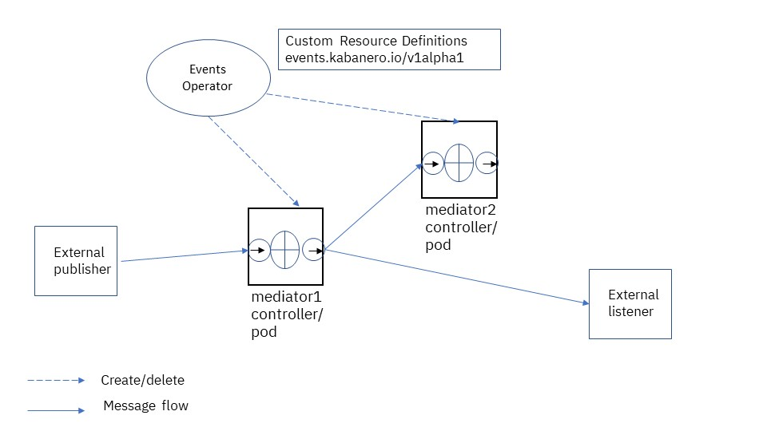

## About this feature

- Feature Name: Events Operator
- Feature Number:
  - https://bigblue.aha.io/features/ICPAROAD-248
  - https://github.ibm.com/IBMCloudPak4Apps/icpa-roadmap/issues/177
  - https://github.com/kabanero-io/events-operator/issues/29
- Architect: Michael Cheng
- Availability Info: Kabanero 0.9.0/CP4Apps 4.2
- Presenters
  - Michael Cheng
  - Hank Ibell

## Overview

The events operator allows users to define a Kubernetes centric event mediation flow. Through custom resource
definitions (CRDs), users can quickly construct mediation logic to receive, transform, and route JSON data structure.

The events operator also contains built-in logic to process github webhook messages for appsody projects. It uses semantic versioning to find the best matching pipeline for the stack version in the project.

### Value to Customer

The use cases for event mediator include:

- Built-in logic to process web hook messages for Appsody projects to trigger Tekton pipelines using semantic versioning.
- Transformation and routing of arbitrary JSON data structure within Kubernetes. 

### Key Concepts



There are two types of containers for the events infrastructure:

- The events-operator is installed by the kabanero operator. It is a Kubernetes operator that reacts to creation/deletion of EventMediator CRDs by creating/deleting 
  - events controllers for each EventMediator.
  - Routes for external access, if configured.
- The events controller is created for each EventMediator CRD instance. The main components for each controller are:
  - event mediator: defines event transforming logic to be run within one container. It consists of an optional https listener, and a list of mediations.
  - event mediation: user defined logic used to transform or route messages. It is based on Common Expression Language (CEL)
  - event connection: defines the connections between mediations, and between mediations and external http(s) listeners .

Like other Kubernetes resources, the event mediators, mediations, and connections may be changed dynamically.

### History

- CP4Apps 4.2/Kabanero 0.9.0: initial release


### Component Dependencies

- Kabanero operator: used to install/uninstall kabanero events
operator

### Specification changes


### System Requirements

- Product Edition: CP4Apps 4.2/Kabanero 0.9.0

### Deprecation and default changes


### How it works

The events operator is installed automatically via the Kabanero custom resource definitions. A typical example for the Kabanero CRD looks like:

```yaml
apiVersion: kabanero.io/v1alpha2
kind: Kabanero
metadata:
  name: kabanero
spec:
  #events:
  #    enabled: true
  #    image: kabanero/events-operator:0.1.0
  stacks:
    repositories:
    - name: central
      https:
        url: https://github.com/kabanero-io/kabanero-stack-hub/releases/download/0.9.0/kabanero-stack-hub-index.yaml
    pipelines:
    - id: default
      sha256: b4ef64ab464941603add8b5c0957b65463dc9bbbbb63b93eb55cf1ba6de733c6
      https:
        url: https://github.com/kabanero-io/kabanero-pipelines/releases/download/0.9.0/kabanero-events-pipelines.tar.gz
```

Note that:

- It is enabled by default. Change the value of `enabled` attribute to `false` to disable it.
- It is typically used to drive kabanero-events-pipelines. However, it may also be configured to drive other pipelines, or other http(s) listeners.

Once installed, the events operator is responsible for maintaining the specifications of the event mediator and event connections CRDs. 
The events mediator CRD is used to define the logic to perform event transformation within one container:

```yaml
apiVersion: events.kabanero.io/v1alpha1
kind: EventMediator
metadata:
  name: mediator1
spec:
  createListener: true
  createRoute: true
  - mediation:
      name: mediation1
      variables:
          - name: <variable-name-1>
            value: <variable-value-1>
          ...
      sendTo: [ "destination1", "destination2", ...  ]
      body:
         <body>
```

Each event mediator may contain one or more mediations. Each mediation contains logic to perform message transformations, including:

- variable declarations and assignments
- declaration of output variables via `sendTo` attribute
- Mediation body that may contain
  - function calls, such as `sendEvent("destination1", header)`
  - if statements
  - switch statements

The built-in logic to process webhook events from github is enabled as follows:

```
piVersion: events.kabanero.io/v1alpha1
kind: EventMediator
metadata:
  name: webhook
spec:
  createListener: true
  createRoute: true
  repositories:
    - github:
        secret: ghe-https-secret
        webhookSecret: ghe-webhook-secret
  mediations:
    - name: webhook
      selector:
        repositoryType:
          newVariable: body.webhooks-appsody-config
          file: .appsody-config.yaml
      body:
         <body>
```

Note that:

- The github secret points to a secret compatible with Tekton pipelines with user id and API token to access github.
- THe webhookSecret contains the secret configured on Github to verify the webhook.
- If the incoming message is a Github webhook message, the `repositoryType` is used to locate a file, in our example `.appsody-config.yaml` in the repository. 
If the file exists, the contents of the file are read into a new variable, and the the logic in the mediation is called.
- Additional variables are also created if the repository is an Appsody Project (the file .appsody-config.yaml exists). See Knowledge Center.

When calling the sendEvent function, the resolution of the destination variable, such as `destination1`
is stored in a separate EventDestinations CRD. For example,

```yaml
apiVersion: events.kabanero.io/v1alpha1
kind: EventConnections
metadata:
  name: example1
spec:
  connections:
    - from:
        mediator:
            name: mediator1
            mediation: mediation1
            destination: destination1
      to:
        - https:
            - url: <url1>
              insecure: true
            - url: <url2>
              insecure: true
    - from:
        mediator:
            name: mediator1
            mediation: mediation1
            destination: destination2
      to:
        - https:
            - url: <url13>
```

## Usage Scenarios


- As an administrator, I want to use organization webhook to trigger all my pipelines so that I do not need to configure webhook for every repository in the organization.
- As an administrator, I want to trigger different pipelines based on the type of the incoming repository, such as Appsody repository, and the tech preview gitops repository.
- As an administrator, I want to use semantic versioning to find the best matching  pipeline to build and deploy an Appsody project, so that as active stacks and pipeline change, the latest best matching version is used.
- As an administrator, I want to re-use my existing pipelines without using the deprecated webhook from the Tekton webhook extension, so that I do not need to change my pipelines when the deprecated component is removed from the product..
- As an administrator, I want to quickly create new transformation and routing of JSON messages across different event sources and destinations so that I efficiently tailor the environment to changing requirements.

## Demonstration

Do a live demo during the interactive presentation, if applicable

## Performance Tuning

N/A

## Troubleshooting

### Relevant log files

The relevant logs are stored within each pod, and may be retrieved via `oc logs <pod-name> -n kabanero`.

- The name of the pod for the events operator is `events-operator-<hash>`.
- The name of the pod for each controller is `<mediator-name>-<hash>`, where `<mediator-name>` is the name of the mediator as specified in the EventMediator CRD.


### Interpreting new log entries

#### Basic Environment Check 

- Ensure the pod for events-operator is running. If it is not running, ensure that events is not disabled in the Kabanero CRD.
- List all mediators: `oc get EventMediator`, and ensure controller pods are created for each mediator. 
  - If the pods are not created, check the logs for the events-operator.
  - If the pods terminate unexpectedly, check the logs for the pods.
- Ensure event connections are available and point to the correct destination URLs: `oc get EventConnections`.
- Check the status of the event mediator as initial triage.
  It may give clues for the next step. For example, 
  ```
  oc get EventMediator <name> -o yaml
  ```

  The following output is a clue that while processing a `push` event from Github, everything worked up to the point of locating a Tekton event listener to trigger the pipeline.

  ```
  status:
  summary:
  - input:
    - name: mediation
      value: webhook
    - name: repository
      value: https://github.ibm.com/kabanero-org-test/test3
    - name: branch
      value: master
    - name: github-event
      value: push
    - name: stack
      value: docker.io/kabanero/nodejs:0.7
    - name: urlExpression
      value: body["webhooks-kabanero-tekton-listener"]
    message: 'Send event to http://UNKNOWN_KABAKERO_TEKTON_LISTENER failed. Error:
      Post http://UNKNOWN_KABAKERO_TEKTON_LISTENER: dial tcp: lookup UNKNOWN_KABAKERO_TEKTON_LISTENER
      on 172.30.0.10:53: no such host'
    operation: send-event
    result: failed
    time: "2020-06-11T15:53:24Z"
  ```
   

#### Tekton Pipeline Not Triggered

From Github webhook configuration page:

- Check the URL and ensure it matches the route for the webhook
- Check the webhook secret and ensure it matches the configured secret
- Check the status of recent history for the webhook messages, which may be found at the bottom of the page for your webhook. The status code gives you more information about why it failed.

Check the logs for the mediator pod to ensure that the message is received. If received:

```
I0611 15:53:23.192315       1 event.go:41] Received request. Header: map[Accept:[*/*] Content-Length:[8392] Content-Type:[application/json] User-Agent:[GitHub-Hookshot/3211ebf] X-Github-Delivery:[03dfdf78-a736-11ea-9582-e0cebf7facea] X-Github-Enterprise-Host:[github.ibm.com] X-Github-Enterprise-Version:[2.19.13] X-Github-Event:[push] X-Hub-Signature:[sha1=8e1d5a02be135927a53a5ff5d24333de7855a73c]]
```

If the mediator contains `repositoryType`, check the log to ensure that the file from the repository is successfully read. 
If the file can not be read, check the configured github secret to ensure the correct user name and API token are configured. 
If the file is read, the content is shown in the log. For example:

```
I0611 15:53:23.919554       1 github_util.go:217] download File from Github: buffer id: "20200605081003.65593170"
project-name: test3
stack: docker.io/kabanero/nodejs:0.7
```

Check a matching mediation is found. If found, you should see log message:

```
I0611 15:53:23.919900       1 eventcel.go:444] Entering Processor.ProcessMessage for mediation webhook,message: &{webhook [dest] 0xc000b1e300 0xc000b1e340 [{<nil> 0xc00052fe90 <nil> <nil> <nil>}]}
```

If no mediation found, it can be due to:

- incorrect github secret
- no matching file found for repositoryType
- no matching URL path for urlPath.

If mediation is found, check that it is able to send event downstream. Check that the EventConnections CRD correctly maps a destination a downstream URL. If not, you'll see a message:

```
I0612 00:04:26.008951    1 status.go:87] AddEventSummary: {0001-01-01 00:00:00 +0000 UTC send-event [{mediation webhook} {repository https://github.ibm.com/tnixa-coffeeshop3/baristahttp} {github-event pull_request} {stack docker.io/appsody/java-openliberty:0.2} {destination dest}] failed Destination not found in any EventConnection}
```

When sending message to Tekton event listener, you should see a message.
(Note: currently the code treats status code 202 as an error. It will be fixed in the future so that it is considered success.):

```
I0611 18:35:04.974189       1 status.go:87] AddEventSummary: {0001-01-01 00:00:00 +0000 UTC send-event [{mediation webhook} {repository https://github.ibm.com/kabanero-org-test/test2} {branch branch1} {github-event push} {stack docker.io/kabanero/nodejs:0.3} {urlExpression body["webhooks-kabanero-tekton-listener"]}] failed Send event to http://el-listener-b4ef64ab.kabanero.svc.cluster.local:8080 failed. Error: Send to http://el-listener-b4ef64ab.kabanero.svc.cluster.local:8080 failed with http status 202 Accepted}
```

If the message has been successfully sent downstream, and there is still an issue with the PipelineRun, check the log of the event listener itself. 
If there is a problem locating an event listener, you will see a message that looks like:

```
E0611 15:53:23.986749       1 kabanero_util.go:334] Unable to find listener from stack for appsody repo docker.io/kabanero/nodejs:0.7
I0611 15:53:23.986789       1 eventcel.go:980] For stack docker.io/kabanero/nodejs:0.7, found event listener http://UNKNOWN_KABAKERO_TEKTON_LISTENER, version: 0.0.0
```

To debug why a an EventListener can not be located:

- check the stack. For example, if building with nodejs,
  ```
  oc get stack nodejs -o yaml
  ```

  And the  output:

  ```
  ...
  status:
  summary: '[ 0.3.6: active ]'
  versions:
  - images:
    - digest:
        activation: f13c6c3022544b6ffc4f0f111b36c0f4d0066accb3d9e9a7f7d1218a7411c159
      id: Node.js
      image: docker.io/kabanero/nodejs
    pipelines:
    - activeAssets:
      - assetDigest: 6c3cfe5100e2e4462b8841f4068fced8a49827250ef9db8d05c692ed91f0c0af
      assetName: listener-b4ef64ab
      group: triggers.tekton.dev
      kind: EventListener
      namespace: kabanero
      status: active
      version: v1alpha1
      ...
  ```

  - Ensure the `summary` indicates stack is active.
  - Ensure the image in the .appsody-config.yaml matches the image name. In our example, `docker.io/kabanero/nodejs`. 
  - Ensure the version number in .appsody-config.yaml semantically matches the version number in the `summary`.
  - Ensure the event listener exists. For our example, it is `listener-b4ef64ab`. 
  - Ensure the EventListener is available:
    ```
    oc get EventListener  listener-b4ef64ab -o yaml
    ```

    And the output:

    ```
    status:
      address:
        url: http://el-listener-b4ef64ab.kabanero.svc.cluster.local:8080
      ...
    ```


### Support Implications

Common problems:

- Typos in the yaml files
- 

### Known Limitations

> Describe user stories that didn't make the cut or any other known limitations

### Failure modes


## Support scope and Open Source
 
 This is suported as part of CP4Apps.

## Deep Dive

https://github.com/kabanero-io/events-operator

### Theory of operation

### Advanced troubleshooting

## Resources

- Where can L2/L3 find more/related info?
  - Specifications: https://github.com/kabanero-io/events-operator
  - Official Documentation: https://www-03preprod.ibm.com/support/knowledgecenter/SSCSJL_4.2.x/guides/integrating-events-operator/integrating-events-operator.html

## Summary


## References

